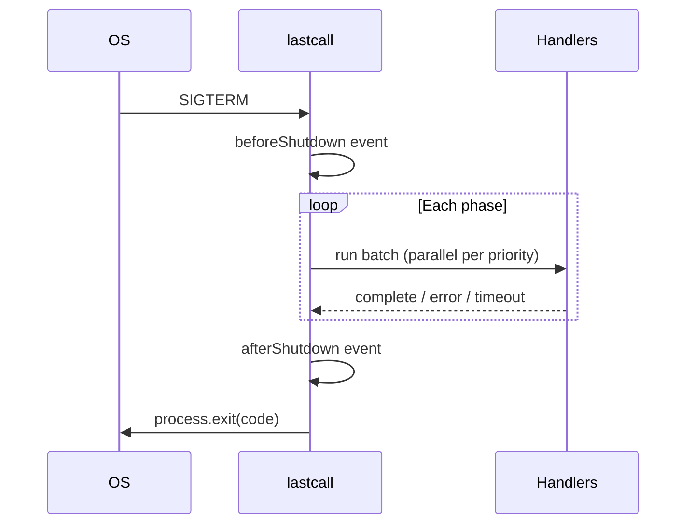

# Shutdown lifecycle



## Trigger sources

| Source                    | How                                  |
| ------------------------- | ------------------------------------ |
| SIGTERM / SIGINT / SIGHUP | Automatic (configurable)             |
| Manual                    | `await lastcall.shutdown('reason')`  |
| Testing                   | `lastcall.simulateSignal('SIGTERM')` |
| uncaughtException         | `captureUncaughtException: true`     |
| unhandledRejection        | `captureUnhandledRejection: true`    |

## Exit codes

| Code | Meaning                                               |
| ---- | ----------------------------------------------------- |
| `0`  | All handlers completed (non-critical failures OK)     |
| `1`  | Critical handler failed, timed out, or global timeout |

## Idempotency

If shutdown is already in progress, additional signals and `shutdown()` calls return the same promise.

## Global timeout

`shutdownTimeoutMs` (default 30s) aborts the entire shutdown. Handlers receive `abortSignal` on their context.

## Handler context

Every handler receives:

```ts
interface HandlerContext {
  reason: string; // why shutdown started
  signal?: ShutdownSignal;
  phase: ShutdownPhase;
  abortSignal: AbortSignal;
}
```
