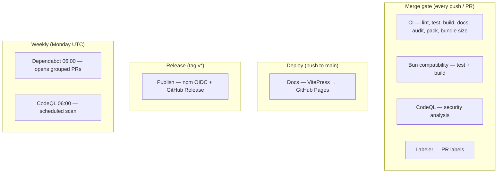

# CI and automation

This page is the **single map** of every automated pipeline in the lastcall repository. Human contributors and Cursor agents should start here when asking “what runs when?” or “why did this workflow fail?”.

Related deep-dives:

- [npm publishing](./npm-publishing.md) — trusted publisher setup, first publish bootstrap, tag releases
- [Running tests](../testing/running-tests.md) — local commands, test layout, env vars
- [Verification matrix](../testing/verification-matrix.md) — what each test layer proves
- [Cursor skills](./cursor-skills.md) — agent playbooks tied to these gates

## Overview



## Workflow reference

| Workflow    | File                                                   | Trigger                                | Blocks merge? | Purpose                                                               |
| ----------- | ------------------------------------------------------ | -------------------------------------- | ------------- | --------------------------------------------------------------------- |
| **CI**      | [`ci.yml`](../../.github/workflows/ci.yml)             | Push / PR to `main` / `master`, manual | **Yes**       | Full quality gate + build + docs + `npm pack --dry-run` + bundle size |
| **Bun**     | [`ci.yml`](../../.github/workflows/ci.yml) (`bun` job) | Same as CI                             | **Yes**       | `npm test` + `npm run build` under Bun runtime                        |
| **Docs**    | [`docs.yml`](../../.github/workflows/docs.yml)         | Push to `main` / `master`, manual      | Advisory      | VitePress build → GitHub Pages                                        |
| **CodeQL**  | [`codeql.yml`](../../.github/workflows/codeql.yml)     | Push / PR / schedule / manual          | Advisory      | Static security analysis (TypeScript)                                 |
| **Labeler** | [`labeler.yml`](../../.github/workflows/labeler.yml)   | PR opened / sync                       | No            | Auto-labels (`ci`, `tests`, `documentation`, …)                       |
| **Publish** | [`publish.yml`](../../.github/workflows/publish.yml)   | Push tag `v*`, manual                  | N/A (release) | npm OIDC publish + GitHub Release from `CHANGELOG`                    |

**Dependabot** ([`dependabot.yml`](../../.github/dependabot.yml)) is not a workflow but opens grouped PRs weekly (Monday 06:00 UTC). Those PRs must pass **CI** and **Bun**.

## CI (merge gate)

**File:** `.github/workflows/ci.yml`  
**Node:** 22 (test toolchain; published library targets Node 18+ via `tsup`)  
**npm:** `11.4.2` (matches `packageManager` in `package.json`)  
**Concurrency:** one run per ref; PRs cancel in-progress runs.

| Step            | Command                 | What it proves                                                   |
| --------------- | ----------------------- | ---------------------------------------------------------------- |
| Install         | `npm ci`                | Reproducible lockfile                                            |
| Quality gate    | `npm run ci`            | Lint, Prettier, `tsc`, Vitest coverage (100% lines), `npm audit` |
| Library         | `npm run build`         | `dist/` ESM + CJS + `.d.ts` via tsup                             |
| Documentation   | `npm run docs:build`    | VitePress links and MD valid                                     |
| Package tarball | `npm pack --dry-run`    | npm publish surface = `dist` + README + LICENSE                  |
| Bundle size     | `gzip -c dist/index.js` | ESM bundle ≤ 15 KB gzipped (README advertises a lean package)    |

### Local equivalent

```bash
npm run ci
npm run build
npm run docs:build
npm pack --dry-run
```

`npm run ci` is the **canonical pre-commit command** — same steps as the CI quality gate. Docs and build are separate locally (mirrors Actions: CI workflow runs them after `npm run ci`).

### Bun compatibility job

lastcall documents **Bun** support (`docs/guides/bun.md`). A separate `bun` job installs deps with `npm ci`, then runs `npm test` and `npm run build` with Bun available on the runner. This is lighter than duplicating the full matrix — merge gate stays one Node 22 job like shieldkit, with Bun as an extra runtime check specific to this library.

**Why not Node 18 in CI?** Runtime target is Node 18+ (`engines`, `tsup` target `node18`), but Vitest 4 / Rolldown requires Node **20.12+** for the test toolchain. Consumers on Node 18 run the compiled `dist/`; CI validates the toolchain on Node 22.

## Docs (GitHub Pages)

**File:** `.github/workflows/docs.yml`  
**Trigger:** push to `main` / `master` (not PRs — avoids deploying unmerged docs).  
**Intentionally skips** re-running the full CI gate — relies on branch protection requiring green **CI** before merge.

## CodeQL {#codeql}

**File:** `.github/workflows/codeql.yml`

TypeScript analysis on `src/` with the `security-and-quality` query pack. `build-mode: none` — no compile step required. Results appear in the GitHub **Security** tab. Runs on push, pull requests, weekly (Mondays 06:00 UTC), and `workflow_dispatch`.

Free for public repositories.

## Dependabot

[`.github/dependabot.yml`](../../.github/dependabot.yml) opens weekly grouped PRs with labels `dependencies` and `automated`.

| Group                    | Patterns                                                  |
| ------------------------ | --------------------------------------------------------- |
| `testing`                | `vitest*`, `@vitest/*`                                    |
| `typescript-and-build`   | `typescript`, `tsup`, `tsx`, `esbuild`                    |
| `linting-and-formatting` | `eslint*`, `@eslint/*`, `prettier*`, `typescript-eslint*` |
| `docs`                   | `vitepress`                                               |
| `security-updates`       | `*` (security advisories only)                            |

`@types/node` semver-major updates are ignored — major tracks Node major; CI uses Node 22.

## Labels {#labels}

[`.github/labeler.yml`](../../.github/labeler.yml) applies PR labels via `pull_request_target`:

| Label           | Paths                                          |
| --------------- | ---------------------------------------------- |
| `ci`            | `.github/**`                                   |
| `dependencies`  | `package.json`, `package-lock.json`            |
| `documentation` | `docs/`, `website/`, `*.md`, `SECURITY.md`     |
| `code`          | `src/**`                                       |
| `tests`         | `test/**`, `**/*.test.ts`                      |
| `examples`      | `examples/**`                                  |
| `cursor`        | `.cursor/**`                                   |
| `security`      | `SECURITY.md`, core shutdown modules in `src/` |

## Publishing {#publishing}

**Preferred:** merge to `main`, tag `vX.Y.Z`, push — [Publish workflow](../../.github/workflows/publish.yml) uses [npm trusted publishing](https://docs.npmjs.com/trusted-publishers) (OIDC, no `NPM_TOKEN`).

1. Merge release PR with dated `CHANGELOG` section and version bump
2. `git tag vX.Y.Z && git push origin vX.Y.Z` (tag must match `package.json`)
3. Workflow runs `npm run ci` → `build` → `npm pack --dry-run` → `npm publish` → GitHub Release from `CHANGELOG`

Full setup (trusted publisher, first publish bootstrap): **[npm publishing](./npm-publishing.md)**.

## Cursor automation

Agent skills and rules live in `.cursor/` and are documented in [Cursor skills](./cursor-skills.md). They are tracked in git (unlike `.cursor/plans/`).

| Policy              | File                                             |
| ------------------- | ------------------------------------------------ |
| Pre-commit gate     | `.cursor/rules/pre-commit-quality-gate.mdc`      |
| Release / CHANGELOG | `.cursor/rules/lastcall-release-changelog.mdc`   |
| CI commands         | `.cursor/skills/lastcall-pre-commit-ci/SKILL.md` |
| End-to-end release  | `.cursor/skills/lastcall-ship-release/SKILL.md`  |

## Comparison with sibling repos

| Pattern         | shieldkit (ai-shield)   | lastcall                    | banal (site)        |
| --------------- | ----------------------- | --------------------------- | ------------------- |
| CI shape        | Single Node 22 job      | Node 22 job + **Bun job**   | Single Node 22 job  |
| `npm run ci`    | lint → test → audit     | lint → **coverage** → audit | lint → test → audit |
| Publish         | OIDC + tag `v*`         | Same                        | N/A (no npm)        |
| Extra workflows | AI SDK compat, Red Team | **Bundle size gate**        | verify-tools weekly |
| Issue templates | None                    | Bug + feature YAML          | None                |

lastcall intentionally omits shieldkit’s **AI SDK Compatibility** and **Red Team** workflows — zero production dependencies, no live-model security surface. It adds **Bun** and **bundle size** checks because those are documented product promises.
